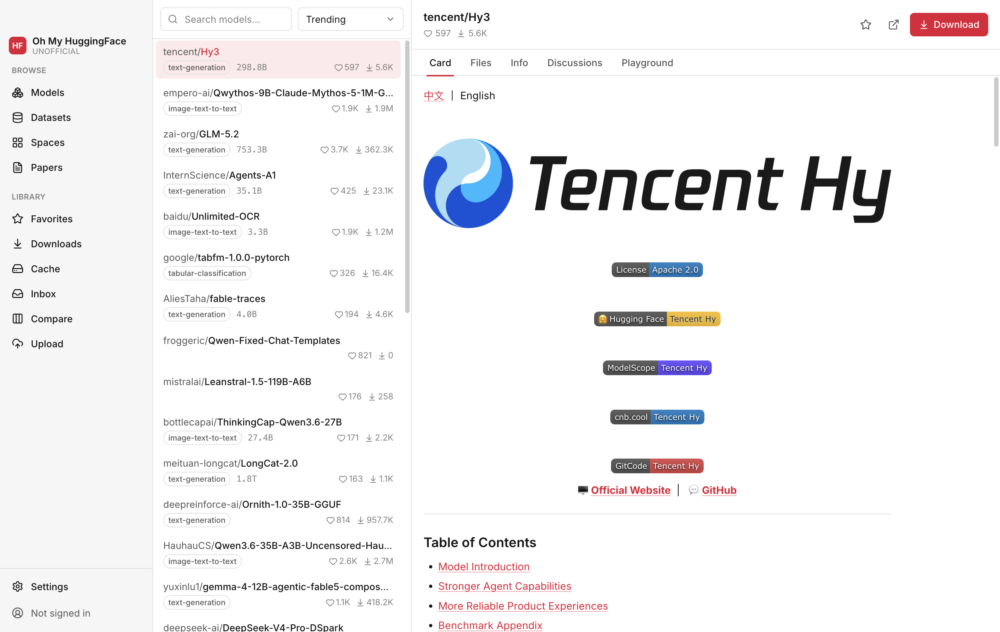

# Oh My HuggingFace

> [!IMPORTANT]
> **UNOFFICIAL.** Oh My HuggingFace is an independent, community-built desktop client for the
> Hugging Face Hub. It is **not affiliated with, endorsed by, or sponsored by Hugging Face, Inc.**
> "Hugging Face" is a trademark of Hugging Face, Inc. and is used here only to refer to the
> service this application connects to.

An open-source, cross-platform (macOS / Windows / Linux) desktop client for browsing the Hugging
Face Hub, managing large model downloads, and plugging models into your local AI toolchain.

**Privacy-first: everything stays on your machine.** No telemetry, no analytics, no external
services beyond the Hugging Face API itself. Your access token is encrypted with your OS keychain
(Electron `safeStorage`) and stored in `~/.oh_my_hf/credentials.json` with owner-only permissions.



## Features

- **Browse** — Models / Datasets / Spaces / Daily Papers in a three-pane, keyboard-first UI with
  virtualized lists, instant model-card rendering (sanitized Markdown), file trees, and metadata.
- **Search everything** — `Cmd/Ctrl+K` command palette: search, filter (task, library, license),
  and sort (trending / likes / downloads).
- **Sign in** — paste a Hugging Face User Access Token; it is encrypted at rest,
  never stored in plaintext, never in `localStorage`.
- **Download manager** — resumable, parallel, queued downloads with speed limiting, SHA-256
  verification, and system notifications. Files land in the **standard HF cache layout**, fully
  interoperable with `transformers`, `huggingface-cli`, and friends.
- **Cache visualizer** — scan your HF cache, see disk usage per repo, and clean stale revisions
  with one click.
- **Follow & inbox** — follow users/orgs/repos and Daily Papers; get system notifications.
- **Compare** — 2–4 models side by side (params, license, downloads, likes).
- **Upload & export** — scan and upload local folders safely; export downloaded files to Ollama,
  LM Studio, or ComfyUI with progress and cancellation.
- **History** — local, searchable browsing history with repository-type filters.
- **i18n** — English and 简体中文 built in; adding a language is a single JSON folder.
- **Dark & light themes**, native menus, and OS conventions on every platform.
- **In-app updates** — installed builds compare their version with the latest published GitHub
  Release, then download and restart-install only after explicit confirmation.

## Install

Grab the latest release for your platform from
[GitHub Releases](https://github.com/oh-my-hf/ohmyhf/releases):

- **macOS** — `.dmg`
- **Windows** — `.exe` (NSIS installer)
- **Linux** — `.AppImage` or `.deb`

### macOS: Gatekeeper / quarantine

macOS release builds use the stable self-signed `OhMyHF-Release` certificate; local builds remain
**ad-hoc signed**. Neither is Developer ID notarized (see [docs/signing.md](docs/signing.md)). After
a browser download, first launch may still need:

```sh
xattr -dr com.apple.quarantine "/Applications/Oh My HuggingFace.app"
```

or right-click the app → **Open** → **Open**.

The app can discover new GitHub Releases from **Settings → About**. Releases signed with the same
self-signed certificate can update in-app; older or differently signed installations use the
GitHub Releases link as the one-time manual fallback.

## Development

Prerequisites: **Node.js ≥ 22**, **pnpm ≥ 11** (`corepack enable`), and a C++ toolchain for
native modules (Xcode CLT on macOS, `build-essential` on Linux, VS Build Tools on Windows).

```sh
pnpm install        # installs deps and rebuilds better-sqlite3 for Electron
pnpm dev            # launches the app with hot reload
pnpm test           # unit tests (vitest)
pnpm typecheck      # strict TS across the workspace
pnpm lint           # ESLint (includes hardcoded-string checks for i18n)
pnpm build          # production build of every package
```

Platform packaging (from `apps/desktop`):

```sh
pnpm --filter oh-my-huggingface-desktop build:linux   # AppImage + deb
pnpm --filter oh-my-huggingface-desktop build:mac     # dmg (ad-hoc signed)
pnpm --filter oh-my-huggingface-desktop build:win     # nsis
```

### Sign-in

Paste a [User Access Token](https://huggingface.co/settings/tokens) in
**Settings → Account**. Prefer a **write** token (or a fine-grained token with the
permissions you need) so downloads of gated repos, discussions, collections, and
Hub notifications all work. The token is encrypted with the OS keychain and stored
at `~/.oh_my_hf/credentials.json`.

### Security

- **The token** is encrypted with the OS keychain (Electron `safeStorage`) and stored at
  `~/.oh_my_hf/credentials.json` (`0600`), **never plaintext and never in localStorage**. The
  file lives outside the per-profile `userData` directory so every session — packaged app,
  `pnpm dev`, extra profiles — shares one login. `OMH_CREDENTIALS_DIR` relocates it (tests use
  this for isolation). Deleting the file signs you out everywhere.
- **No network calls forward the token cross-host**: the `Authorization` header is only sent to
  `huggingface.co` API hosts, never to the CDN/`resolve` redirect targets.

### Releasing

Releases are cut from `main` by a commit whose subject is `[RELEASE] Vx.y.z`. See
[docs/releasing.md](docs/releasing.md) for the full flow; in short: bump all four workspace
manifest versions, then land a commit titled e.g. `[RELEASE] V0.2.0`. CI verifies the source,
builds and smoke-tests all three platforms, and validates the updater manifests before it creates
the `v0.2.0` tag or draft release. Publishing happens only after the remote asset list is verified.

## Architecture

```
packages/shared     @oh-my-huggingface/shared    shared types + typed IPC contract
packages/hub-api    @oh-my-huggingface/hub-api   pure-TS Hub API client (zero Electron deps)
apps/desktop        oh-my-huggingface-desktop    electron-vite app (main / preload / renderer)
```

- The **main process** owns all network, downloads, cache scanning, and polling (via `hub-api`);
  heavy work runs in `worker_threads` off the main thread.
- The **renderer** is view-only React (React Router, Zustand, TanStack Query/Virtual, Tailwind,
  Radix). `contextIsolation: true`, `nodeIntegration: false`, `sandbox: true`, strict CSP.
- The whole IPC surface is a **typed contract** in `packages/shared` — no magic strings; every
  handler validates its input.
- Local SQLite (better-sqlite3) stores favorites, history, download tasks, follows, and settings.
  The token lives only in the separate safeStorage-encrypted credentials file; a legacy database
  token is migrated and deleted on first successful restore.

## Contributing

See [CONTRIBUTING.md](CONTRIBUTING.md). Translations are especially welcome — locales live in
`apps/desktop/src/renderer/src/i18n/locales/<lang>/` (renderer) and
`apps/desktop/src/main/i18n/locales/` (native menus & notifications).

## License

[Apache-2.0](LICENSE). Not affiliated with Hugging Face, Inc.

## Friendly Link

- [linux.do](https://linux.do) —— Where possible begins
